# 人工视觉与交互验收报告 v1.0

- 日期：2026-07-14
- 分支：`development`
- 验收代码：`427d2d2`
- 环境：由当前源码构建的临时 Docker 镜像；仅使用合成测试数据与容器内临时路径
- 视口：桌面 `1440 × 900`、手机 `390 × 844`、平板 `768 × 1024`

## 结论

**有条件通过。** 桌面端和手机端的 Dashboard、Assets 主流程、详情页、弹窗与错误反馈均可正常使用，未发现页面级横向溢出或浏览器控制台错误。项目详情的技能矩阵在手机和平板宽度下必须横向滚动，但界面没有明确的滚动提示，第三个 Agent 列会直接被截断；同时存在若干可访问性与触控尺寸问题。因此当前版本适合继续集成与功能验证，但还不能称为完整的“人类体验验收全部通过”。

## 验收步骤

| # | 场景与操作 | 健康度 | 结果 |
|---:|---|---|---|
| 1 | 桌面 Dashboard：核对统计、导航及主操作入口 | 健康 | 统计异步加载后稳定；入口清晰；无布局破损。 |
| 2 | 桌面 Assets：查看列表、来源状态、搜索、筛选和操作按钮 | 健康 | 信息层级清楚；长描述正常换行；按钮对齐正常。 |
| 3 | Add Asset 弹窗：打开、检查初始焦点、按 Escape 关闭 | 健康 | 首个输入框自动获得焦点；Escape 可关闭。完整 Tab 焦点循环未能可靠验证。 |
| 4 | Asset 详情：检查长描述、来源、维护说明、警告及实例信息 | 健康 | 长文本和路径可换行；信息密度较高但结构可理解。 |
| 5 | 桌面 Projects：检查项目列表、Agent 状态和移除操作 | 需润色 | 功能明确；页面较稀疏，且紫色主操作与其余页面的黑色主操作不一致。 |
| 6 | Add Project：提交无效相对路径 | 健康 | 鼠标提交后明确显示 `path must be an absolute path`。浏览器自动控制中的 Enter 提交未触发，但既有 Chromium E2E 通过，建议补一次真实 Chrome/Safari 键盘复核。 |
| 7 | 桌面 Project 详情：检查状态说明、批量操作和技能矩阵 | 健康 | 桌面宽度下矩阵清楚，状态标签和说明对应明确。 |
| 8 | 手机 Dashboard：检查导航折行、卡片堆叠和按钮尺寸 | 健康 | 无页面级横向溢出；导航和卡片顺序自然。 |
| 9 | 手机 Assets：检查 Agent 开关、搜索、筛选、列表卡片和操作 | 基本健康 | 无页面级横向溢出，主要操作可见；部分触控目标偏小。 |
| 10 | 手机 Project 详情：检查状态说明、批量操作和矩阵 | 需改进 | 矩阵容器可横向滚动，但第三个 Agent 列被截断且无明显滚动提示。 |
| 11 | 平板 Project 详情：检查固定侧栏与矩阵可用宽度 | 需改进 | 侧栏占用 240px 后矩阵仍需横向滚动，第三列被截断；问题在 768px 宽度仍存在。 |
| 12 | 手机 Asset 详情：检查长文本、路径、统计卡和操作 | 健康 | 长路径换行正常；卡片与操作按单列排列，无页面级溢出。 |

## 主要发现

### P1 — 窄屏项目矩阵缺少可发现的横向浏览方式

在 `390px` 下，矩阵可视宽度约 `356px`、内容宽度约 `605px`；在 `768px` 下，固定侧栏后矩阵可视宽度约 `478px`、内容宽度仍约 `605px`。容器技术上可横向滚动，但第三个 Agent 列被截断，界面没有渐隐、箭头、提示文字或明显滚动条来告诉用户还有内容。

建议优先处理：为横向溢出提供清晰提示，并固定首列或将每个技能改为窄屏卡片；平板断点可考虑收窄/折叠侧栏。

### P2 — 选择状态没有提供给辅助技术

Assets 页的 Agent 开关通过颜色表示启用/停用，但按钮没有暴露 `aria-pressed` 或等价的可访问状态。屏幕阅读器用户无法判断当前选择。

### P2 — 输入框依赖 placeholder 作为名称

搜索框及新增弹窗字段缺少持久可见、关联到输入控件的标签。placeholder 输入后会消失，也不应作为唯一的字段说明。建议使用 `<label for>` 或明确的 `aria-label`，并保留可见标签。

### P2 — 多个移动端触控目标偏小

移动端导航、Agent 芯片、筛选按钮和部分操作按钮的高度约为 `26–36px`。即使部分控件可能符合 WCAG 例外条件，仍低于常用的 `44px` 舒适触控目标，容易误触。

### P3 — Projects 与 Assets 的视觉语言不一致

Projects 列表使用紫色主按钮和链接强调，Assets、Dashboard 及详情页主要使用黑色/深灰主操作。两套强调色并存，会削弱“同一产品、同一操作层级”的感觉。

### P3 — 桌面空间利用率偏低

Dashboard 和 Projects 在宽屏上留有较大空白，项目行内容较少而移除操作靠最右侧。当前不妨碍使用，但后续可通过限制内容宽度或提升信息密度改善扫描效率。

## 已确认的正向表现

- 手机端主导航成功转为顶部布局，Dashboard、Assets 和 Asset 详情均无页面级横向溢出。
- 长描述、来源路径和安装路径在桌面及手机端均能换行，没有撑破卡片。
- Add Asset 弹窗具备初始焦点，Escape 可关闭。
- Add Project 的无效路径错误反馈就近、清楚且可理解。
- 状态不仅依赖颜色，还配有文字标签与说明；危险操作使用红色强调。
- 本次验收过程中浏览器控制台没有发现 warning 或 error。

## 可访问性与证据边界

- 已通过 DOM/可访问名称检查确认缺少字段标签及 `aria-pressed` 状态。
- 浏览器控制接口未能稳定模拟 Tab 键焦点移动，因此没有对弹窗焦点陷阱作出通过或失败判断。
- 自动控制环境中的 Enter 提交行为与既有 Chromium E2E 结果不一致；在真实 Chrome 与 Safari 中各做一次纯键盘提交后，才能关闭该项风险。
- 本报告是基于当前构建的人工视觉与交互抽查，不替代屏幕阅读器、真实触屏设备和跨浏览器专项测试。

## 截图证据

### 1. Dashboard — 桌面

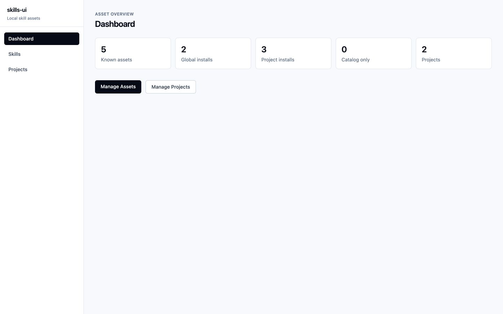

### 2. Assets — 桌面

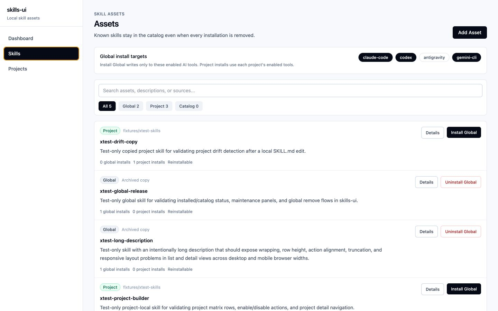

### 3. Add Asset 弹窗 — 桌面

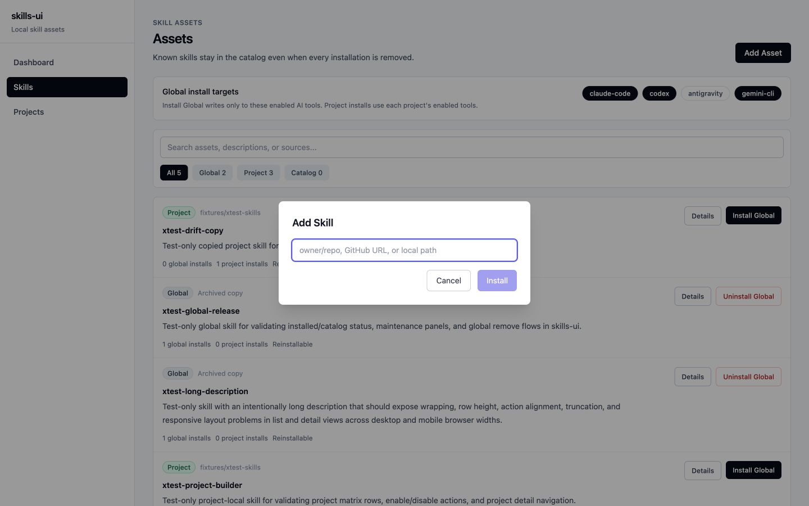

### 4. Asset 详情 — 桌面

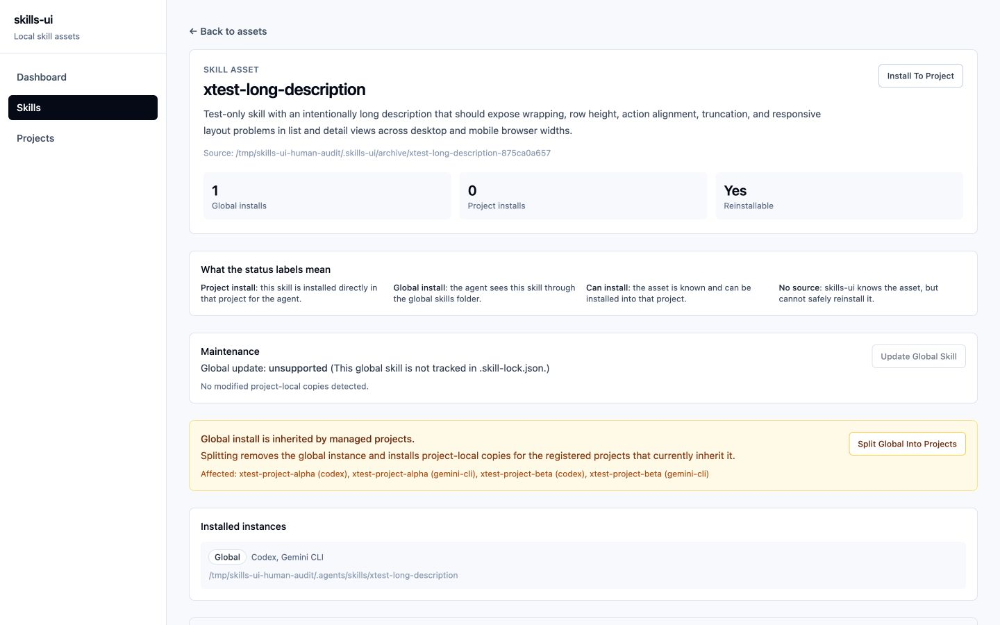

### 5. Projects — 桌面

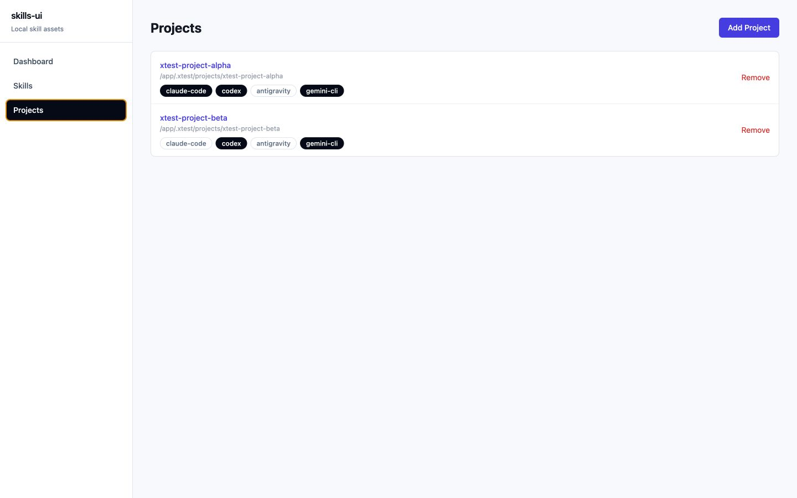

### 6. Add Project 错误反馈 — 桌面

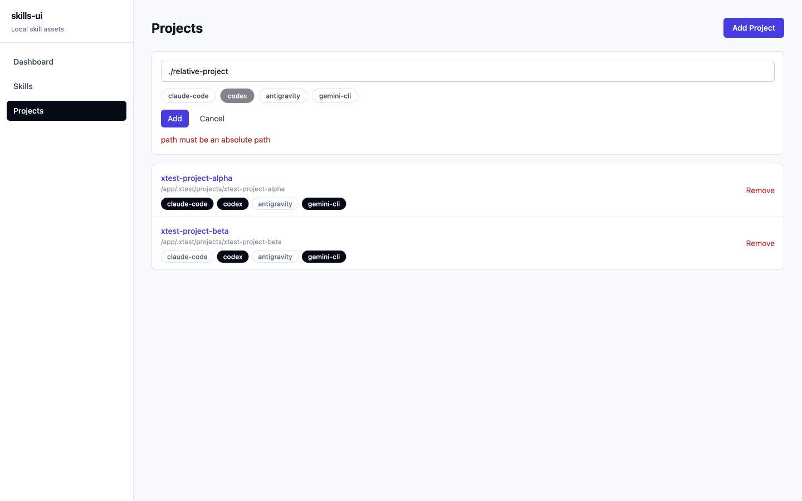

### 7. Project 详情 — 桌面

### 8. Dashboard — 手机 390px

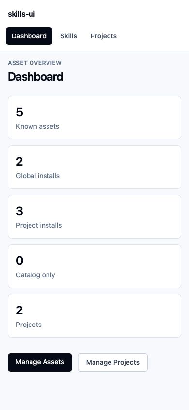

### 9. Assets — 手机 390px

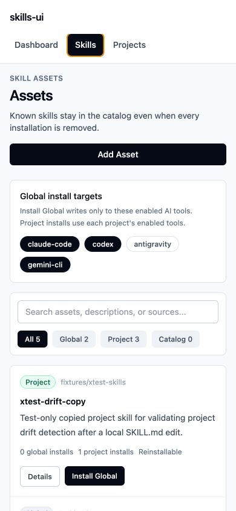

### 10. Project 详情 — 手机 390px

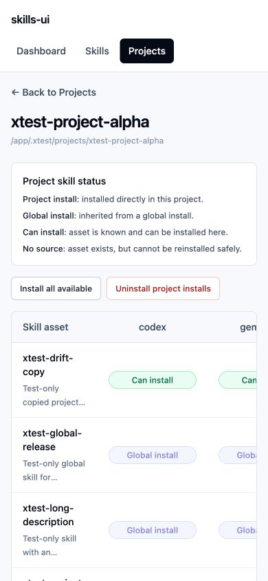

### 11. Project 详情 — 平板 768px

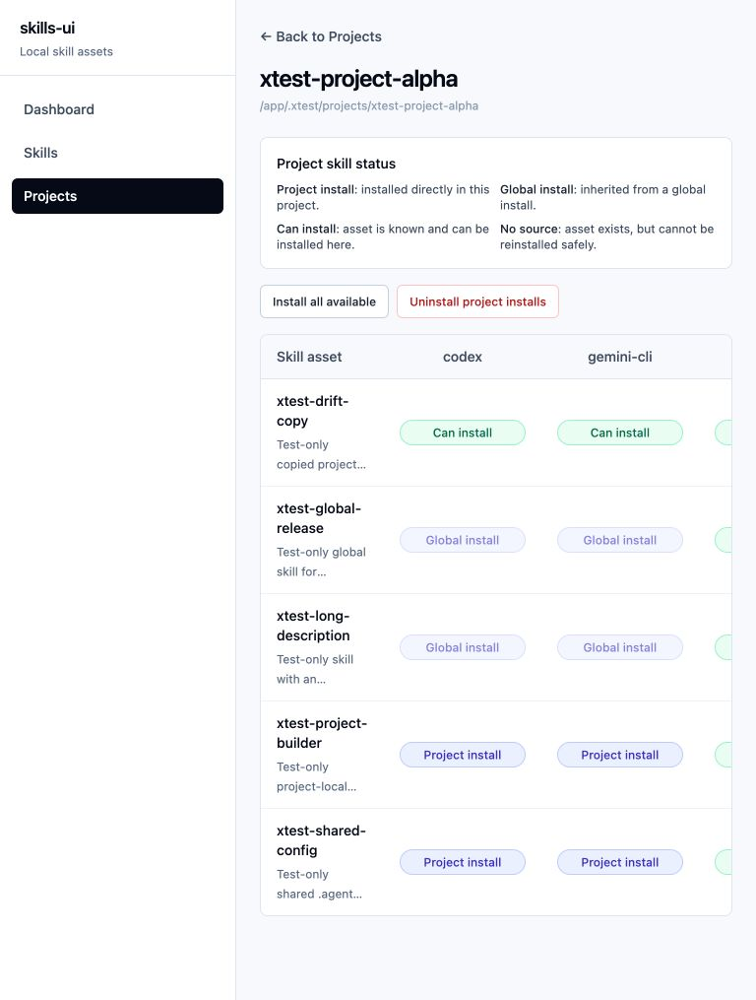

### 12. Asset 详情 — 手机 390px

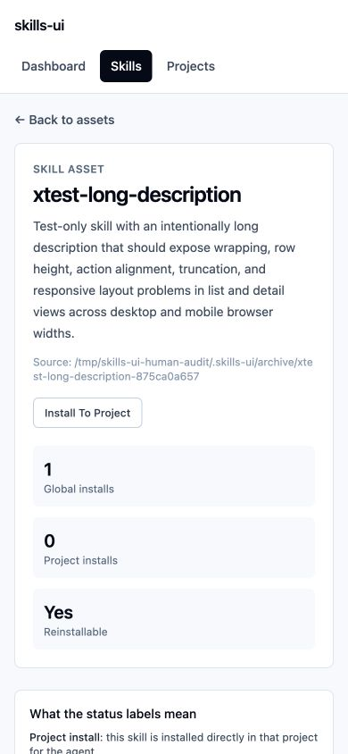
