# 桌面端产品体验验收报告 v1.1

- 日期：2026-07-15
- 分支：`development`
- 验收代码：`427d2d2`
- 产品定位：管理本机 Skills、安装实例、项目范围与 Agent 可见性的桌面管理工具
- 环境：当前源码构建的临时 Docker 环境；仅使用合成数据与容器内路径
- 本版变化：撤销手机和平板作为验收对象；从产品经理和桌面用户角度重新评估完整任务、业务语义、交互风险与流程闭环

## 结论

**当前不建议判定为产品体验验收通过。**

它已经是一套能查看和操作状态的管理界面，但还不是一套让用户放心管理本机 Skills 的完整产品。主要问题不在画面，而在产品模型没有转化成清楚、闭环、可预期的用户流程：

1. “资产”与“安装实例”在文档中已经分开，在界面上仍被混在一起。
2. 用户点击“Install To Project”后无法继续完成目标安装，而是被送到普通项目列表。
3. 状态标签同时承担操作按钮；点击 `Project install` 会立即卸载，没有确认或影响预览。
4. 本次实际卸载后，当前资产详情立即变成 `Skill not found`，资产随后以新 ID 在目录中重现。数据没有丢，但用户任务和页面身份断裂。
5. Dashboard 展示数量，却没有回答“现在有没有异常、数据是否新鲜、我该先处理什么”。
6. 首次使用的三个空状态都只说“没有数据”，没有形成上手路径。

因此，当前版本更接近“功能型管理后台”，还没有达到“用户可独立理解、放心操作、遇到问题能恢复”的产品状态。

## 目标用户与核心任务

目标用户是同时使用 Codex、Claude Code、Gemini CLI 等工具的开发者，希望在一台电脑上完成：

1. 看清这台电脑知道哪些 Skills，以及它们是否健康。
2. 注册需要纳入管理的项目。
3. 从本地目录或远程源添加 Skill。
4. 明确选择安装到全局、某个项目以及哪些 Agent。
5. 识别全局继承、项目本地副本、漂移和来源缺失。
6. 安全地安装、卸载、迁移、恢复或忘记资产。
7. 在外部 CLI 或文件系统发生变化后，确认界面已经与真实状态同步。

## 验收步骤

| # | 场景 | 健康度 | 用户体验结论 |
|---:|---|---|---|
| 1 | 从 Dashboard 判断机器当前状态 | 部分健康 | 数量易读，但没有异常、更新、漂移、失败项目、扫描时间或下一步建议。 |
| 2 | 浏览并筛选资产目录 | 部分健康 | 搜索、筛选、来源和实例数量有价值；列表仍以全局安装为默认主操作，维护风险没有进入列表。 |
| 3 | 从来源添加新资产 | 需要重构 | `Add Asset` 打开 `Add Skill`，最终按钮叫 `Install`，且默认直接全局安装；没有“仅加入目录”或目标选择。 |
| 4 | 添加无效来源并恢复 | 不健康 | 错误直接暴露 CLI 命令和内部路径，用户看不到可执行的修复建议。 |
| 5 | 查看资产来源、实例和维护状态 | 部分健康 | 来源、实例、Agent、项目和漂移信息齐全；维护状态缺少恢复动作，部分技术状态是噪音。 |
| 6 | 点击项目安装状态进行管理 | 失败 | `Project install` 看起来是状态，实际是立即卸载按钮；无确认，操作后详情页变成 `Skill not found`。 |
| 7 | 卸载后回到资产目录核对 | 部分健康 | 资产确实保留为 `Catalog only`，但 ID 改变，原详情 URL 失效，破坏连续性和信任。 |
| 8 | 注册项目并选择受管 Agent | 部分健康 | 可输入绝对路径并选择 Agent；没有路径预检、扫描预览、推断结果或保存反馈。 |
| 9 | 在项目内查看和批量管理 Skills | 高风险 | 状态矩阵信息完整，但状态和动作混用；批量安装/卸载没有影响预览，批量卸载没有确认。 |
| 10 | 第一次进入空 Dashboard | 需要改进 | 只有 5 个零和两个平级入口，用户不知道应先注册项目还是先添加 Skill。 |
| 11 | 第一次进入空 Assets | 需要改进 | 只有 `No assets found`，没有来源示例、发现机制或上手说明。 |
| 12 | 第一次进入空 Projects | 需要改进 | 只有 `No projects registered`，没有说明注册项目的价值、后续扫描内容或安全边界。 |
| 13 | 从资产详情执行 Install To Project | 失败 | CTA 丢失当前 Skill 上下文，只进入普通项目列表；用户必须重新理解并寻找下一步。 |

## 最高优先级问题

### P0 — 卸载操作同时存在“意外触发”和“详情失效”

在资产详情矩阵中，`Project install` 是状态名称，却被做成可点击按钮。用户点击后没有确认，也没有“将从哪个项目、哪些 Agent、哪些目录移除”的预览。实际操作后页面直接显示 `Skill not found`；回到目录后，资产仍存在，但 ID 已变化并转为 `Catalog only`。

这不是单纯的 404 页面问题，而是核心产品承诺被打断：产品声称资产在实例移除后仍会保留，但当前页面身份没有随资产迁移，用户会先得到“资产丢失”的结论。

建议：

- 状态徽标与操作按钮彻底分离。
- 使用明确动词：`Remove from project`、`Install in project`。
- 卸载前展示受影响的项目、Agent 和目录，并要求确认。
- 资产 ID 对安装状态变化保持稳定；如果确实需要重算，服务端返回新 ID，前端自动替换 URL 或重定向。
- 完成后显示清晰结果：实例已移除，资产仍在目录，可重新安装。

### P0 — Install To Project 不是一个可完成的流程

资产详情的 `Install To Project` 只链接到 `/projects`。目标 Skill、当前来源和用户意图全部丢失，项目列表也没有“为这个 Skill 选择项目”的状态。

建议把目标选择放在资产详情中：

1. 选择全局或一个/多个已注册项目。
2. 展示目标项目已管理的 Agent。
3. 预览最终安装位置和继承关系。
4. 执行并显示逐目标结果。

项目列表可以作为没有项目时的补充分支，但注册完成后应返回原资产并继续安装，而不是结束流程。

### P0 — 批量卸载缺少安全确认和范围预览

Project Detail 顶部的 `Uninstall project installs` 会对整个项目执行多项删除，但界面没有确认步骤，也没有告诉用户将影响多少 Skill、哪些 Agent、是否保留目录资产、失败时如何处理。

建议：先生成变更预览，再确认执行；结果需要区分成功、失败和未变化。批量安装也应显示预计新增数量，避免“不知道按钮会做多少事”。

### P1 — 产品主模型仍然是“全局安装优先”，不是“资产管理”

页面同时使用 `Skills`、`Assets`、`Add Asset`、`Add Skill`、`Install`。新增流程没有把“保存为可管理资产”和“创建安装实例”分开，而是直接调用全局安装。资产列表每行的主要动作也是 `Install Global`。

建议统一为：

- 对象统一叫 `Skill` 或 `Skill asset`，不要在同一流程内切换。
- 新增向导先解析来源和展示识别结果，再让用户选择：仅加入目录、全局安装、安装到项目。
- 全局不是默认优先级，而是一个明确目标。
- 全局 Agent 设置移到独立 Settings/Targets 区域，目录页只显示当前摘要和入口。

### P1 — Dashboard 没有承担“健康中心”的职责

当前 Dashboard 只显示资产数和项目数。并且 `Global installs`、`Project installs` 实际统计的是“至少有该类实例的资产数量”，标签容易被理解为实例总数。

用户真正需要首先看到：

- 多少项目扫描失败。
- 多少项目副本被修改。
- 多少 Skill 有更新。
- 多少资产来源缺失或冲突。
- 最近一次扫描时间，以及立即重新扫描的入口。
- 最需要处理的 1–3 项问题。

### P1 — 外部变化兼容存在，但用户无法确认同步状态

产品允许用户在外部运行 CLI 或直接修改文件，但界面没有明确的 `Reconcile/Rescan` 操作、上次同步时间或本次发现的变化摘要。用户无法判断看到的是磁盘现实还是旧缓存。

建议：在全局页和项目页都提供重新扫描，显示 `Last scanned`、扫描范围、错误项目和变化数量；在 Dashboard 提供统一扫描入口。

### P1 — 发现漂移但没有恢复工作流

详情页能识别 `Modified project copies`，这是很好的基础。但用户只能看到项目名，不能比较、接受或恢复。

建议为每个修改副本提供：

- 查看修改位置或差异。
- 从来源重新安装。
- 将当前副本保存为新的归档基线。
- 保留本地修改并暂时忽略。

### P1 — 错误信息不适合作为产品反馈

添加不存在的来源时，界面直接显示完整 CLI 命令与内部路径。这既难以理解，也可能在真实环境里暴露本机目录结构。

建议默认显示面向用户的错误：`找不到该本地目录，请检查路径或权限。` 技术详情放入折叠区，并在展示前清理真实主目录、令牌和敏感参数。

### P1 — 首次使用缺少明确的上手顺序

空 Dashboard、空 Assets 和空 Projects 都是“零数据说明”，没有回答“为什么要做”“先做什么”“完成后会发生什么”。

建议空 Dashboard 直接提供三步设置：

1. 注册一个项目并确认 Agent。
2. 扫描现有 Skills，或从来源添加第一个 Skill。
3. 选择全局或项目目标并完成第一次安装。

如果产品更希望用户先导入 Skill，也应明确说出推荐顺序，而不是给两个平级的 `Manage` 按钮。

## 项目管理层面的改进

Projects 页当前更像配置列表，尚未回答项目是否健康。建议每个项目显示：

- 管理的 Agent。
- 已安装、继承、可安装、已修改的 Skill 数量。
- 上次扫描时间和扫描错误。
- 项目路径是否仍存在、是否可读。
- 进入项目、重新扫描、编辑设置三个明确操作。

Agent 芯片不应仅靠黑白颜色表示开启状态，也不应点击后无提示地立即保存。建议使用带标签的复选框或开关，并说明修改 Agent 范围会不会移动、安装或卸载已有 Skill。

## 建议的新实施顺序

现有待办方向基本正确，但本次体验发现需要调整优先级：

1. **先修卸载后的详情失效、稳定 ID/重定向和所有 destructive action 的确认。**
2. **完成资产详情内的目标安装流程。**
3. **增加 Reconcile、扫描时间、失败项目和健康摘要。**
4. **重做首次使用空状态与项目注册预检。**
5. **补齐漂移恢复、Catalog 删除、成功反馈和操作记录。**
6. **最后统一术语、Agent 设置交互和视觉风格。**

## 当前做得好的部分

- 搜索、范围筛选和来源标签让资产目录具备基本管理效率。
- 资产详情能同时显示来源、安装实例、项目和 Agent，这是建立信任所需的关键信息。
- `Global install`、`Project install`、`Can install`、`No source` 的概念说明是正确方向。
- 资产实例移除后确实会保留为 `Catalog only`，说明底层产品模型大体成立；需要修复的是身份和流程连续性。
- 漂移检测已经存在，后续重点是把检测结果转化成可执行的恢复决策。
- 项目注册范围明确，不会默认扫描整台电脑，符合本地管理工具的安全边界。

## 可访问性与证据边界

- Agent 状态按钮缺少 `aria-pressed` 等选中状态；输入框主要依赖 placeholder。
- 状态标签被做成按钮，会同时影响视觉用户、键盘用户和屏幕阅读器用户对控件结果的预期。
- 本次重点是桌面产品流程，没有进行手机、平板或完整屏幕阅读器验收。
- 测试使用合成数据，没有连接真实 GitHub 仓库，也没有验证大规模项目/Skill 数量下的性能和批量失败恢复。
- 浏览器操作确认了核心流程和错误状态；技术限制导致原生确认弹窗文案没有作为截图证据纳入报告。

## 截图证据

### 1. Dashboard 只有数量，没有健康与下一步

### 2. 资产目录默认以全局安装为主要动作

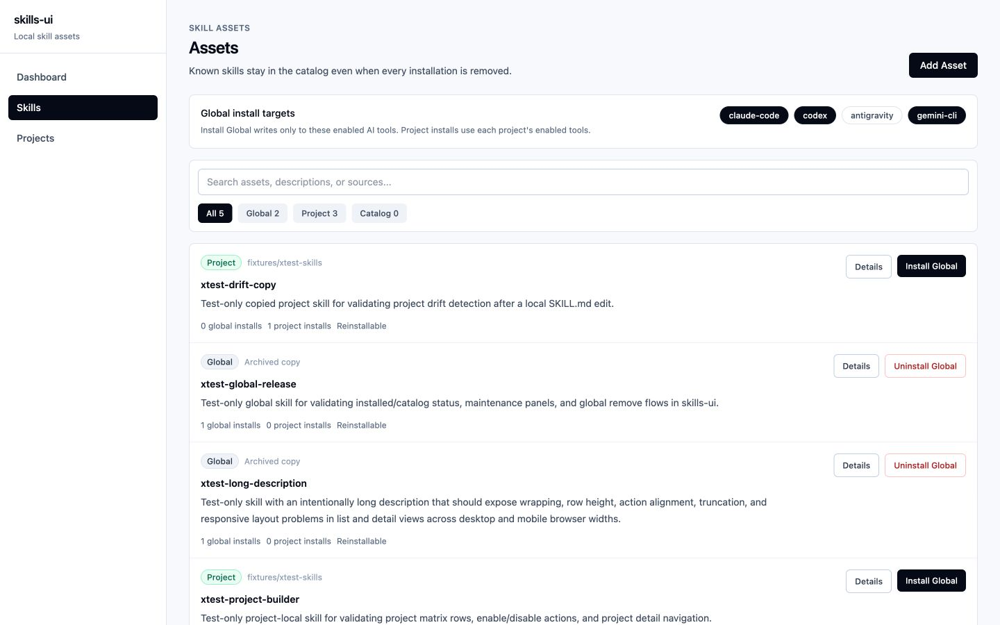

### 3. Add Asset、Add Skill 与 Install 三种语义混在一起

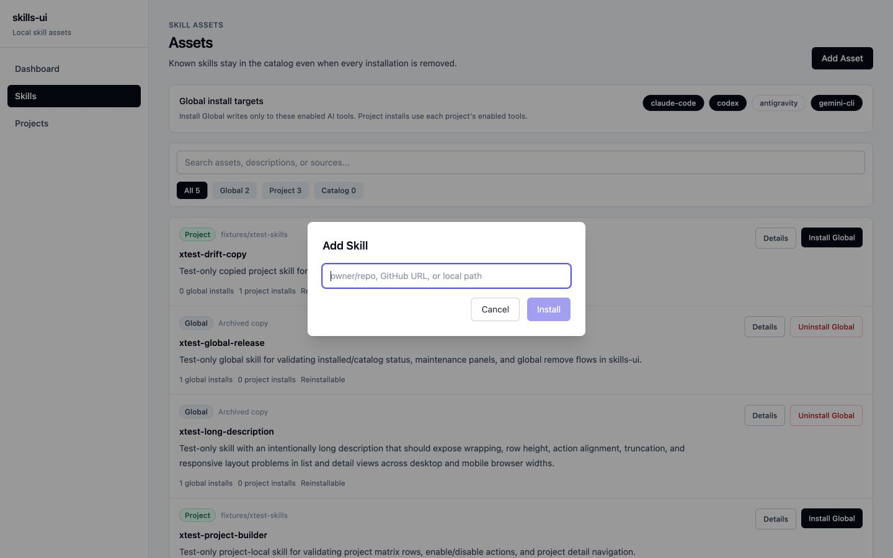

### 4. 无效来源暴露原始命令和内部路径

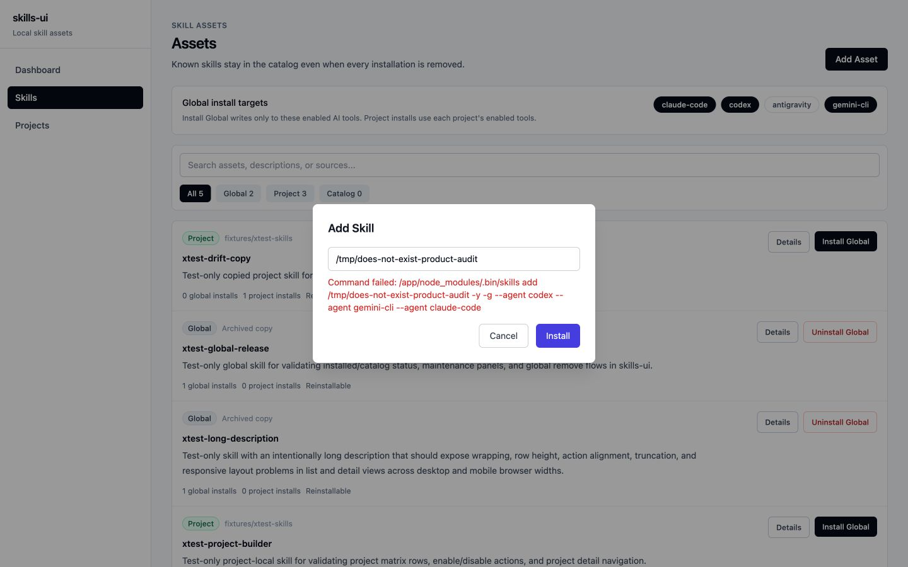

### 5. 资产详情信息完整，但漂移没有恢复动作

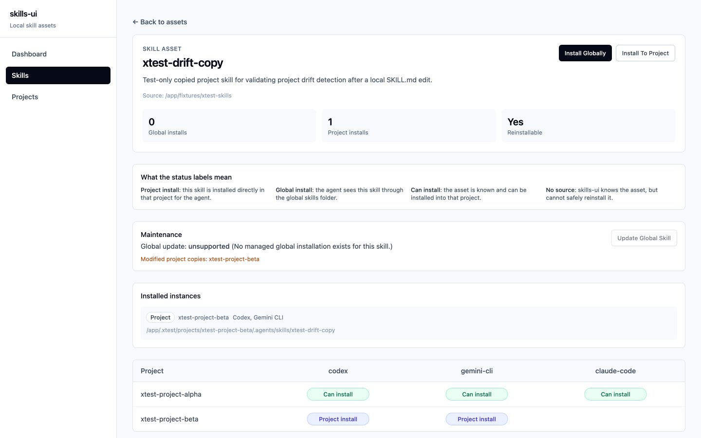

### 6. 点击状态完成卸载后，详情页变成 Skill not found

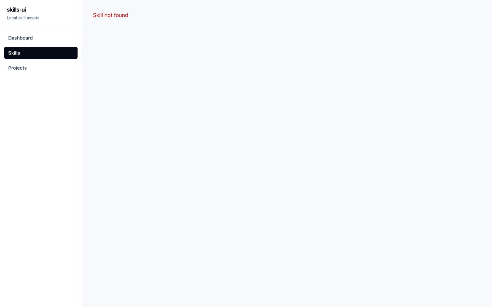

### 7. 资产仍在目录，但变成新 ID 的 Catalog only

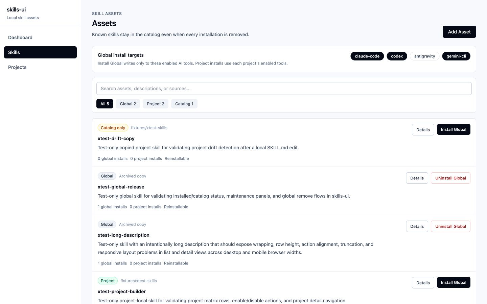

### 8. 项目注册只有路径和 Agent 选择，没有预检和扫描预览

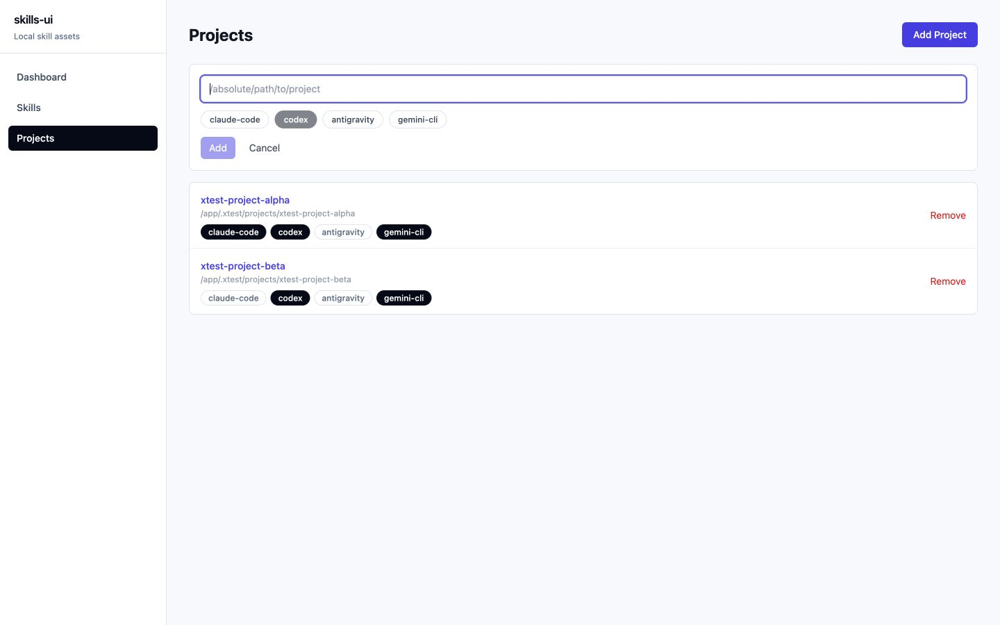

### 9. 项目矩阵把状态、单项动作和高风险批量动作放在同一层

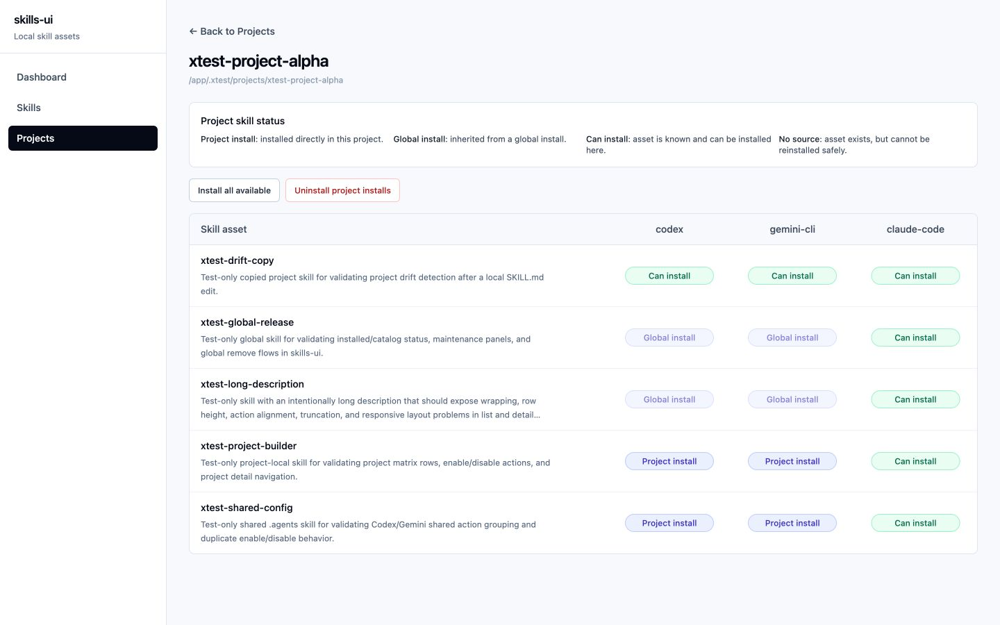

### 10. 空 Dashboard 没有推荐的第一步

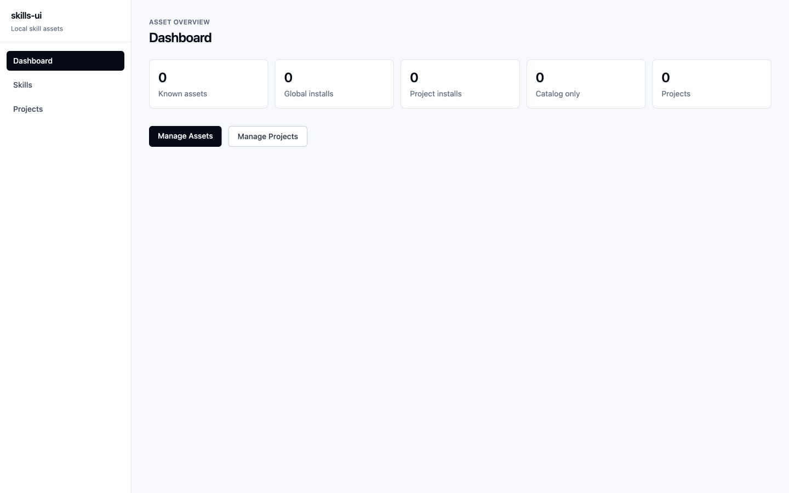

### 11. 空资产目录缺少来源和发现引导

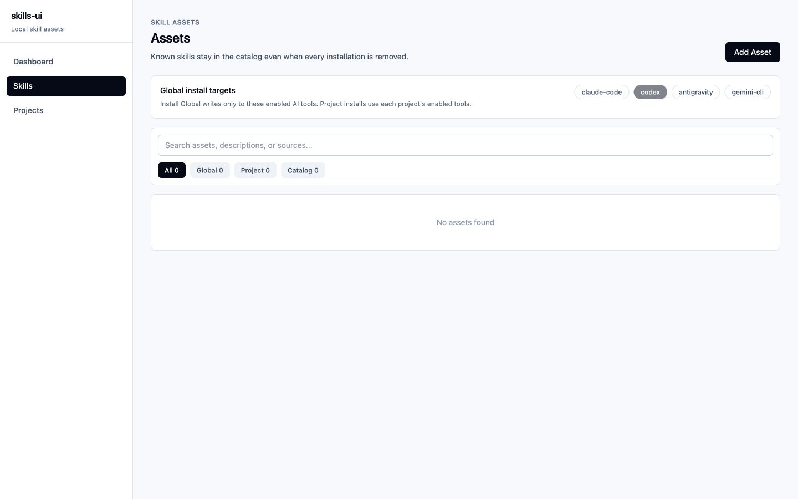

### 12. 空项目页没有解释注册后的价值和行为

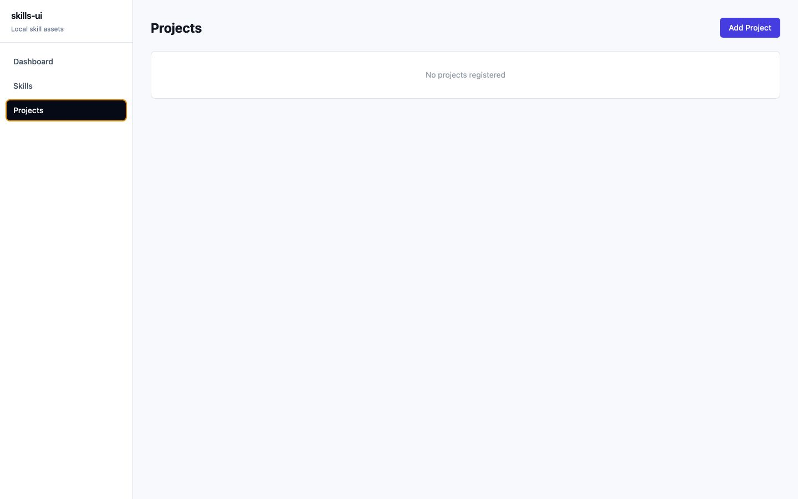

### 13. Install To Project 最终只到普通项目列表

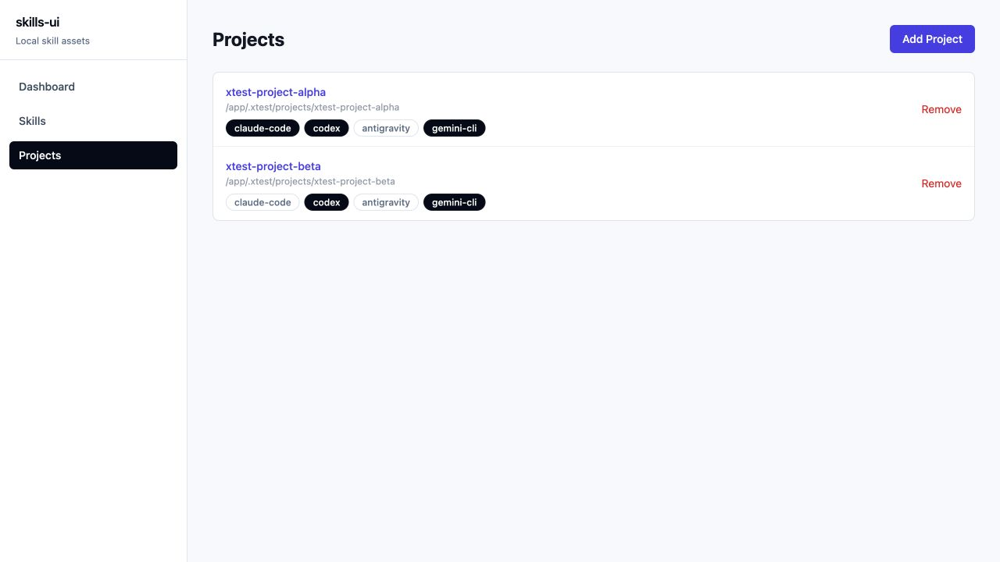
