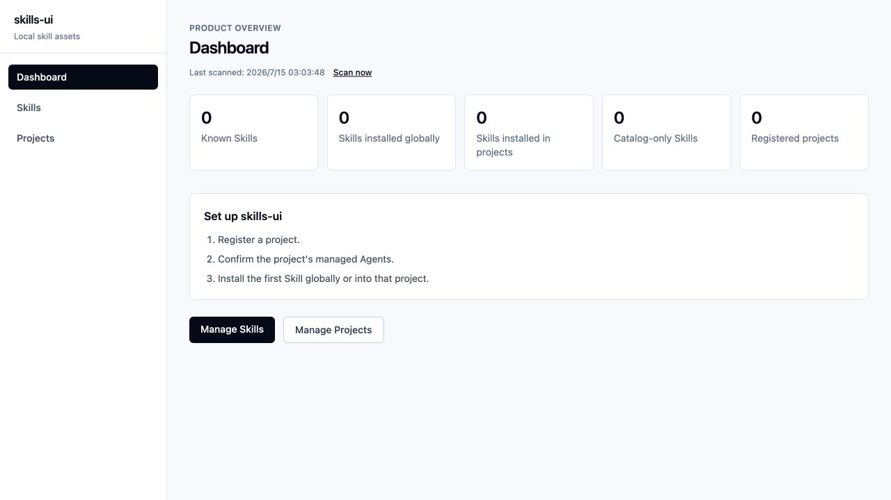
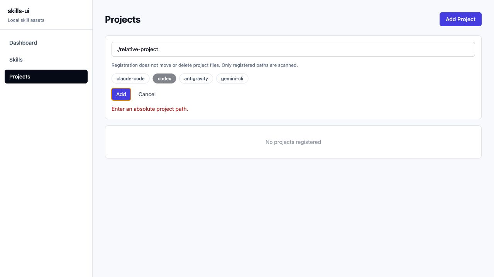
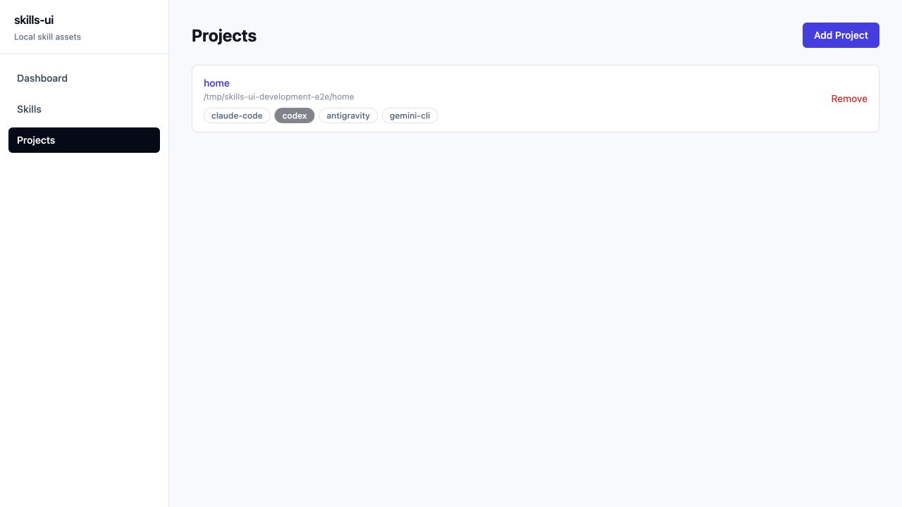
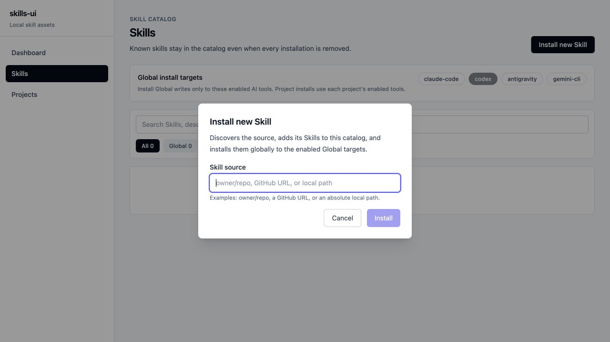
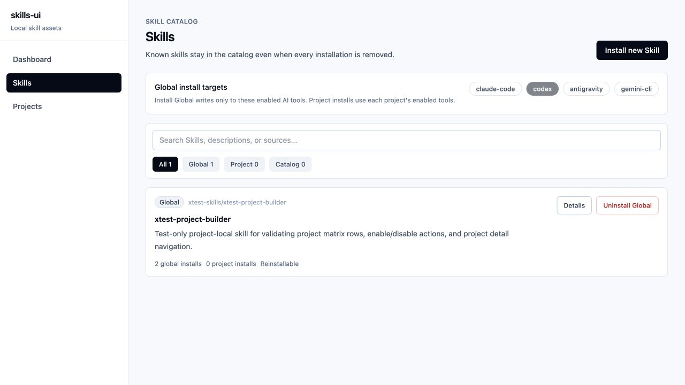
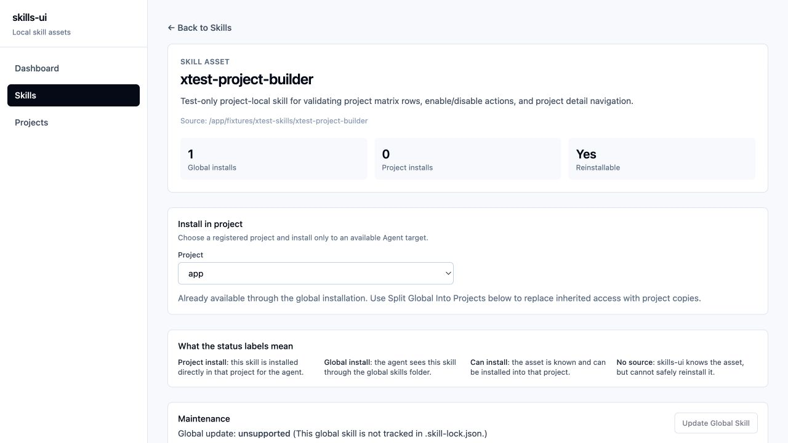
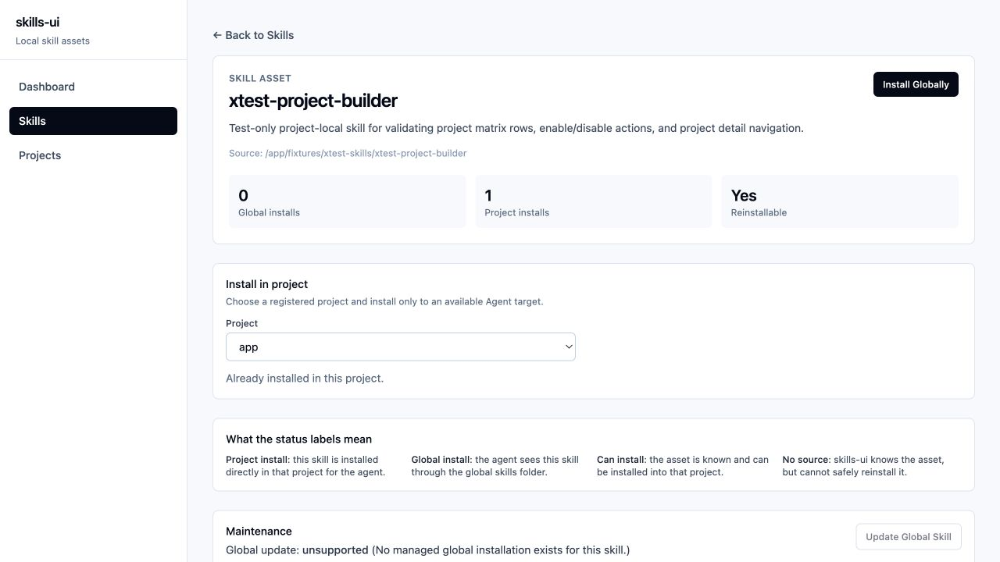

# 桌面端产品体验验收报告 v1.2

- 日期：2026-07-15
- 分支：`development`
- 产品定位：管理当前电脑上的 Skills、安装范围、项目与 Agent 可见性的桌面工具
- 验收环境：最新源码构建的临时 Docker 环境；只使用合成数据与容器内路径
- 验收范围：桌面端业务流程、交互语义、安全边界、恢复能力、基本键盘与表单可访问性

## 结论

**本轮桌面产品体验验收通过。**

v1.1 中阻断用户独立完成任务的核心问题已经闭环：Skill 身份在安装状态变化后保持连续；状态与操作分离；项目安装可以从 Skill 详情内完成；移除、批量卸载和拆分全局安装都有影响确认；Dashboard 能说明数据是否新鲜和哪里需要处理；首次使用有推荐顺序；漂移副本与目录资产都有恢复或忘记动作。

本次人工验收又发现并修复了三处容易造成误解或误操作的问题：

1. `Split Global Into Projects` 现在会明确提示受影响项目与 Agent，并说明成功后会移除全局安装。
2. 全局继承和已经安装到项目的状态不再显示为笼统的“没有可用 Agent 目标”。
3. 项目路径输入框增加了关联标签，错误信息继续使用可感知的 `alert` 反馈。

当前仍有少量非阻断的表达与信息密度优化空间，见“后续建议”。

## 目标用户的核心任务

桌面用户现在可以完成以下完整链路：

1. 从 Dashboard 判断当前清单是否新鲜、是否有异常以及下一步做什么。
2. 注册一个明确的项目目录并选择受管 Agent。
3. 从本地目录或远程来源安装新 Skill，并清楚知道这是全局安装。
4. 在 Skill 详情选择具体项目和 Agent，完成项目范围安装。
5. 区分全局继承、项目本地安装、可安装与来源缺失。
6. 在执行移除、批量卸载或全局拆分前看见影响范围并确认。
7. 对修改过的项目副本重新安装，对无实例目录资产执行安全忘记。
8. 通过 `Scan now` 重新读取磁盘状态，确认外部变化已同步。

## 验收步骤与健康度

| # | 场景 | 健康度 | 验收结果 |
|---:|---|---|---|
| 1 | 首次进入空 Dashboard | 通过 | 三步引导说明先注册项目、再安装 Skill、最后选择目标；入口与推荐顺序一致。 |
| 2 | 输入无效项目路径 | 通过 | 客户端阻止相对路径提交，显示明确错误和安全边界说明；输入框有程序化标签。 |
| 3 | 注册项目并选择 Agent | 通过 | 注册后项目保留清晰名称、路径与 Agent 范围；从 Skill 发起时可返回原详情继续任务。 |
| 4 | 安装新 Skill | 通过 | 入口、标题和按钮统一使用 Skill 术语，并明确该动作会创建全局安装及其影响范围。 |
| 5 | 查看全局安装结果 | 通过 | 列表和详情能区分 Skill 数量与安装范围，并提供继续安装到项目的入口。 |
| 6 | 处理全局继承 | 通过 | 明确说明该项目通过全局安装获得 Skill；拆分动作在执行前展示项目、Agent 和全局移除影响。 |
| 7 | 安装到指定项目 | 通过 | 用户留在当前 Skill 详情内选择项目与 Agent；完成后显示 `Already installed in this project.`，并提供明确的 `Remove from project`。 |
| 8 | 移除与批量操作 | 通过 | 状态徽标不可点击；破坏性动作使用动词、确认影响范围，并提供逐项成功/失败摘要。 |
| 9 | 卸载后的身份连续性 | 通过 | 原 Skill ID 仍可解析，旧 URL 自动归一到稳定 ID；目录资产不会因实例移除而看似丢失。 |
| 10 | 漂移恢复和目录清理 | 通过 | 修改过的项目副本可从来源重新安装；无实例 Skill 可安全忘记，外部来源目录不被删除。 |
| 11 | Dashboard 健康与同步 | 通过 | 显示最后扫描时间、正确的 Skill 范围计数、关注项和手动扫描入口。 |
| 12 | 错误与隐私 | 通过 | 面向用户的错误不会回传原始 CLI 命令、本机主目录、令牌或敏感参数。 |

## 做得好的部分

- 核心对象统一为 Skill，用户不再需要在 Asset、Add Skill、Install 等混合语义之间猜测。
- “目录中的 Skill”和“安装实例”已经转化为可理解、可恢复的产品模型，而不只是底层数据结构。
- 项目安装是一个连续任务：选择目标、执行、反馈、后续移除都在同一详情上下文完成。
- 状态与动作在视觉和语义上分离，显著降低误点卸载的风险。
- 全局继承被解释为可用状态，而不是错误或无目标状态。
- Dashboard 从计数页转成了轻量健康中心，能够回答“数据何时扫描、哪里需要关注、下一步做什么”。
- 安全边界符合本地管理工具预期：只扫描注册路径，错误经过清理，测试与验收不接触宿主机真实 Skill 数据。

## 后续建议（非阻断）

1. 列表卡片中的 `global installs` 当前更接近“全局目录实例数”，而 Dashboard 统计的是“拥有全局安装的 Skill 数”；建议后续把卡片文案改为 `global directories` 或折叠为单一全局状态。
2. `window.confirm` 能可靠阻止误操作，但样式和信息结构有限；后续可换成应用内确认面板，集中展示 Skill、项目、Agent、目录和保留策略。
3. Skill 详情的状态术语说明完整但偏高，占用较多纵向空间；熟练用户可能更适合按需展开。
4. 项目页和 Skill 来源仍会展示完整本地路径。这对本机管理有诊断价值；如果存在共享屏幕场景，可增加“默认折叠路径/点击显示”的隐私模式。

## 可访问性与证据边界

- 已验证：项目路径有程序化标签；错误与成功反馈使用 `alert`/`status`；状态徽标不可交互；主要按钮可由键盘触发；添加项目支持 `Escape` 取消；确认流程有自动化回归覆盖。
- 未声明完整 WCAG 合规。本轮未进行真实屏幕阅读器、200% 缩放、颜色对比计算和完整手工焦点顺序审计。
- 人工验收使用应用内桌面浏览器的原生窗口尺寸；其强制 viewport 覆盖不稳定，因此没有把指定像素尺寸作为验收结论。
- 原生确认弹窗的影响文案由 Playwright 回归测试验证；浏览器驱动无法稳定保留该系统弹窗作为截图证据。
- 所有数据均为 `/app` 等合成容器路径，没有使用或记录宿主机秘密信息与真实用户路径。

## 自动化与构建验收

最终提交前重新执行以下检查：

- Vitest 单元与服务端集成测试。
- Playwright 桌面端完整 E2E 流程。
- TypeScript 服务端构建与 Vite 生产构建。
- `Dockerfile.test` 构建及容器内完整测试。
- `git diff --check` 与变更范围隐私扫描。

具体通过数量与提交哈希以本次交付消息和 Git 历史为准。

## 截图证据

### 1. 首次使用给出可执行顺序

### 2. 无效项目路径被阻止并解释

### 3. 项目注册后的范围清晰

### 4. 安装新 Skill 明确全局影响

### 5. 全局安装结果可见

### 6. 全局继承状态有业务解释

### 7. 项目安装完成后状态与移除动作分离

